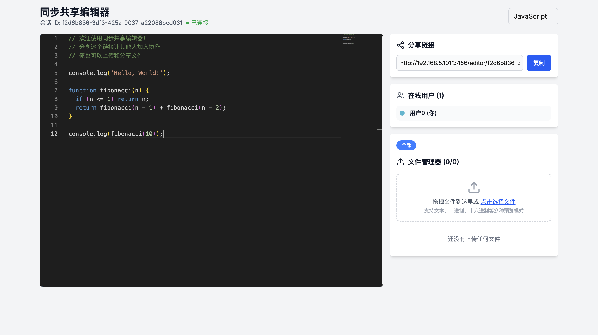

# Share Anything 📤


[中文](./doc/README_zh.md)


> 🚀 Instantly share code and files in real-time with anyone, anywhere.

## ✨ Features

- 💻 Real-time code collaboration
- 📁 File sharing support
- 📄 PDF preview functionality
- 👥 Multiple user collaboration
- 🔒 Secure file handling
- 🎨 Syntax highlighting for various programming languages
- 🔗 Shareable links
- 📱 Responsive design


## 🚀 Getting Started

### Prerequisites

- Node.js 22.17 or later
- npm or yarn
- Git

### Installation

```bash
# Clone the repository
git clone https://github.com/caoyang2002/ShareAnything.git

# Navigate to project directory
cd ShareAnything

# Install dependencies
pnpm install

# Start the development server
pnpm run dev
```

## 🔧 Environment Variables

`.env.development` is the environment file for development settings; you need to change the `ip`.

## 📖 Usage

1. 🌐 Visit `http://your_ip:3000`
2. 📝 Create a new share by clicking "New Share"
3. 💾 Choose between code or file sharing
4. 🔗 Share the generated link with collaborators
5. 👥 Collaborate in real-time!


## 🐳 Docker

```bash
docker pull caoyang2002/share-anything:latest
```

Change `NEXT_PUBLIC_SERVER_IP` to the IP address of your own device.


## 🗂️ Project Structure

```
src/
├── app/                 # Next.js 13 app directory
├── components/          # Reusable React components
├── lib/                 # Core utilities and services
├── styles/             # Global styles
├── types/              # TypeScript type definitions
└── utils/              # Helper functions
```

## 👏 Acknowledgments

- [Monaco Editor](https://microsoft.github.io/monaco-editor/)
- [PDF.js](https://mozilla.github.io/pdf.js/)
- [Socket.IO](https://socket.io/)

## 📫 Contact

caoyang2002 - [@caoyang2002](https://twitter.com/caoyang2002)

Project Link: [https://github.com/caoyang2002/ShareAnything](https://github.com/caoyang2002/ShareAnything)

---

⭐️ Star this repo if you found it helpful!

⬆ Back to top