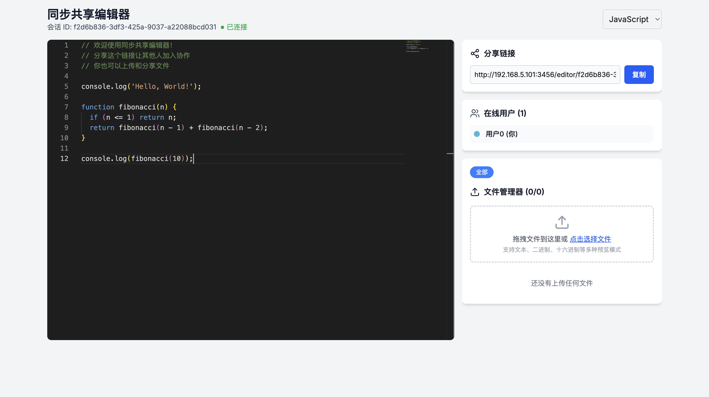

# Share Anything 📤

[EN](../README.md)

        



> 🚀 随时随地，与他人实时共享代码与文件。

## ✨ 功能特性

- 💻 实时协作编码  
- 📁 支持文件传输  
- 📄 在线预览 PDF  
- 👥 多人同时协作  
- 🔒 安全的文件处理  
- 🎨 多语言代码高亮  
- 🔗 一键生成分享链接  
- 📱 响应式界面设计  

## 🚀 快速开始

### 前置条件

- Node.js ≥ 22.17
- pnpm

### 安装步骤

```bash
# 克隆仓库
git clone https://github.com/caoyang2002/ShareAnything.git

# 进入项目目录
cd ShareAnything

# 安装依赖
pnpm install

# 启动开发服务器
pnpm run dev
```

## 🔧 环境变量

`.env.development` 是开发配置的环境变量，你需要修改 `ip`


## 📖 使用方法

1. 🌐 打开 `http://localhost:3000`  
2. 📝 点击「New Share」创建新的分享  
3. 💾 选择「代码分享」或「文件分享」 
4. 🔗 将生成的链接发送给协作者  
5. 👥 实时开始协作！

## 🐳 Docker

```bash
docker pull caoyang2002/share-anything:latest
```

修改 `NEXT_PUBLIC_SERVER_IP` 为你自己设备的 ip

## 🗂️ 项目结构

```
src/
├── app/                 # Next.js 13 应用目录
├── components/          # 可复用的 React 组件
├── lib/                 # 核心工具与服务
├── styles/              # 全局样式
├── types/               # TypeScript 类型定义
└── utils/               # 辅助函数
```

## 🤝 贡献指南

1. Fork 本仓库  
2. 创建功能分支（`git checkout -b feature/amazing-feature`）  
3. 提交更改（`git commit -m 'Add some amazing feature'`）  
4. 推送分支（`git push origin feature/amazing-feature`）  
5. 提交 Pull Request  

## 👏 致谢

- [Monaco Editor](https://microsoft.github.io/monaco-editor/)  
- [PDF.js](https://mozilla.github.io/pdf.js/)  
- [Socket.IO](https://socket.io/)

## 📫 联系方式

caoyang2002 – [@caoyang2002](https://twitter.com/caoyang2002)  

项目地址：[https://github.com/caoyang2002/ShareAnything](https://github.com/caoyang2002/ShareAnything)

---

⭐️ 如果对你有帮助，请给仓库点个星！

⬆ 返回顶部